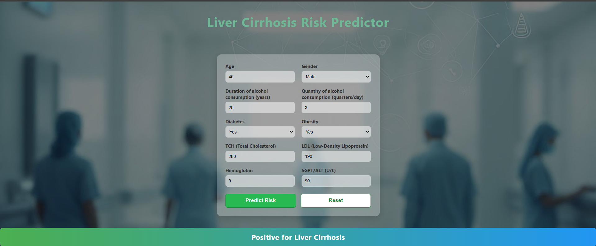

# 🚀 Revolutionizing Liver Care: Predicting Liver Cirrhosis using Advanced Machine Learning Techniques

Welcome to a new era in liver healthcare! This project harnesses the power of machine learning to **predict the risk of liver cirrhosis** using clinical and laboratory data.  
With a user-friendly web interface and robust backend, this tool empowers clinicians and researchers to make data-driven decisions for better patient outcomes.

---

## 🌟 Key Features

- **🔬 Accurate Predictions:** Advanced ML models trained on real clinical data.
- **⚖️ Class Imbalance Handling:** Uses undersampling and SMOTE for fair, balanced predictions.
- **🖥️ Web App:** Simple Flask interface for instant, interactive predictions.
- **📊 Transparent Evaluation:** Confusion matrix and classification report for every model.
- **🔄 Easy Customization:** Modular code for data, model, and UI updates.

---

## 🗂️ Project Structure

```
LiverCirrohsisPrediction/
│
├── Data/
│   └── archive (6) (1).csv         # Raw dataset
│
├── Flask/
│   ├── app.py                      # Flask web application
│   ├── templates/
│   │   └── index.html              # Web form template
│   ├── rf_acc_68.pkl               # Trained RandomForest model
│   └── normalizer.pkl              # Scaler for input normalization
│
├── Training/
│   └── model_training.py           # Model training and preprocessing script
│
├── requirements.txt                # Python dependencies
└── README.md                       # Project documentation
```

---

## 🚦 Quick Start

### 1. **Clone the Repository**
```sh
git clone https://github.com/Bhagyabonam/LiverCirrohsisPrediction
cd LiverCirrohsisPrediction
```

### 2. **Install Dependencies**
```sh
pip install -r requirements.txt
```

### 3. **Prepare the Data**
- Place your dataset (`archive (6) (1).csv`) in the `Data/` folder.

### 4. **Train the Model**
```sh
cd Training
python model_training.py
```
- This will preprocess the data, balance the classes, train the model, and save the model and scaler in the `Flask/` directory.

### 5. **Run the Web App**
```sh
cd ../Flask
python app.py
```
- Open your browser and go to [http://127.0.0.1:5000](http://127.0.0.1:5000)
- Enter patient details and click **Predict Risk** to see the result.

---

## 📝 Notes

- The model is trained to handle class imbalance using **undersampling** and **SMOTE**.
- For best results, use more real negative samples if available.
- The web app expects the same feature order and preprocessing as used in training.

---

## 🧩 Dependencies

- Python 3.8+
- Flask
- pandas
- scikit-learn
- imbalanced-learn
- numpy
- matplotlib, seaborn (for EDA, optional)

All dependencies are listed in `requirements.txt`.

---

## ⚠️ Disclaimer

This project is for **educational and research purposes only**.  
**Not for clinical use without validation.**

---

## 🙏 Acknowledgements

- **Dataset:** https://www.kaggle.com/datasets/bhavanipriya222/liver-cirrhosis-prediction
- **Developed by:** Bonam Bhagya Sri Lakshmi

---

## 💡 Screenshots
## 🖼️ Demo



---

Thank you for checking out this project!  
Feel free to fork, contribute, or reach out with questions and ideas.
